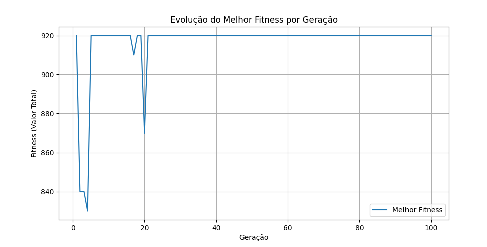
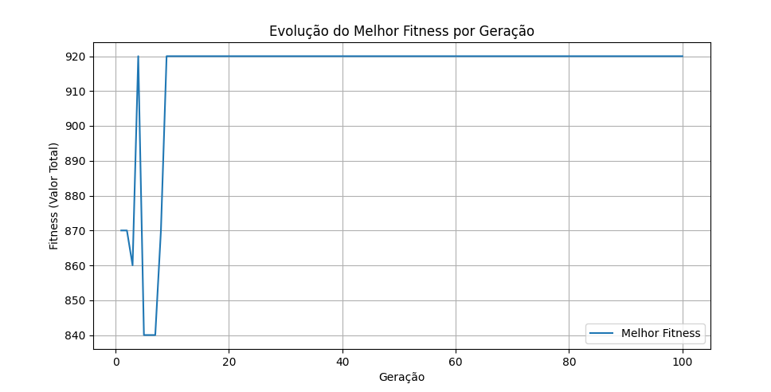
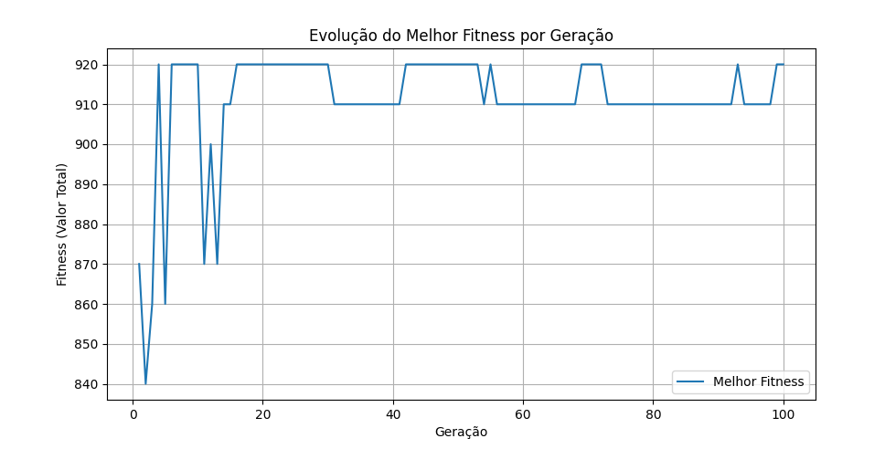

# Problema da Mochila Binário (Algoritmo Genético)

Jessé Silva & Jônatas de Souza

## Problema da Mochila Binária

O problema da mochila binária (0/1 knapsack) consiste em escolher um subconjunto de itens, cada um com um peso e um valor, de modo a maximizar o valor total sem exceder a capacidade máxima da mochila. Cada item pode ser selecionado no máximo uma vez — por isso a representação natural é binária (0 = não levar, 1 = levar).

## Fluxograma — fluxo principal

1. Início
2. Gerar população inicial (e estrutura do cromossomo)
3. Avaliação da população inicial
4. Critério de parada? (se sim → Fim; se não → 5)
5. Seleção
6. Cruzamento
7. Mutação
8. Avaliação da nova população
9. Substituição (substituir população antiga pela nova)
10. Fim (retornar resultados)

## Passo 1 — Início

Esta etapa agrupa as escolhas iniciais do projeto — representação, parâmetros e detalhes que definem a execução do AG.

### Codificação (alfabeto genético adotado)
- Alfabeto: {0, 1} — representação binária (bits). Cada gene indica presença (1) ou ausência (0) do respectivo item na mochila.

### Cromossomos (quantidade de genes em cada indivíduo)
- Cada indivíduo (cromossomo) é um vetor de comprimento `n_itens`.
- No código atual `n_itens = 10`, portanto cada cromossomo possui 10 genes.

### Parâmetros genéticos (valores na implementação atual)
- `tamanho_populacao = 100` — número de indivíduos por geração (população fixa).
- `prob_crossover = 0.8` — taxa de cruzamento (80%).
- `tipo de crossover`: ponto único (single-point crossover) — descrito em Passo 6.
- `taxa_mutacao = 0.01` — taxa de mutação por gene (1%).
- `n_geracoes = 100` — número máximo de gerações.

## Passo 2 — Gerar população inicial

### Geração da população inicial
A população inicial é gerada aleatoriamente por `inicializar_populacao()` que chama `criar_individuo()` repetidamente. Cada gene é inicializado com 0 ou 1 com probabilidade uniforme.

```py
def inicializar_populacao():
    """Inicializa a população."""
    return [criar_individuo() for _ in range(tamanho_populacao)]

def criar_individuo():
    """Cria um indivíduo aleatório (vetor binário)."""
    return [random.randint(0, 1) for _ in range(n_itens)]
```


## Passo 3 — Avaliação da população inicial

### Função de Avaliação (Fitness)

A função de fitness é definida em `fitness(individuo)`. Ela calcula o valor total dos itens selecionados se o peso total não exceder a capacidade da mochila. Caso contrário, aplica uma penalização proporcional ao excesso de peso, dado por `(peso_total - capacidade) * 10`.

```py
def fitness(individuo):
    """Calcula o fitness: valor total se peso <= capacidade, senão penalizado."""
    peso_total = sum(pesos[i] for i in range(n_itens) if individuo[i] == 1)
    valor_total = sum(valores[i] for i in range(n_itens) if individuo[i] == 1)
    if peso_total > capacidade:
        return valor_total - (peso_total - capacidade) * 10
    return valor_total

```
## Passo 4 — Critério de parada?

### Critério de parada

Atualmente o critério é um contador de gerações (`for geracao in range(n_geracoes)`) usado em `algoritmo_genetico()` — ou seja, o algoritmo pára após `n_geracoes`.


## Passo 5 — Seleção

### Seleção por roleta (fitness-proporcional)

A seleção por roleta é implementada em `selecao_roleta(populacao)`. Cada indivíduo é selecionado com probabilidade proporcional ao seu fitness ajustado (para evitar valores negativos), que é obtido subtraindo o mínimo fitness de todos os indivíduos. Se todos os fitness forem negativos ou zero, a seleção é aleatória.

```py
def selecao_roleta(populacao):
    """Seleção por roleta: proporcional ao fitness (ajustado para não-negativo)."""
    fitnesses = [fitness(ind) for ind in populacao]
    min_f = min(fitnesses)
    fitnesses_ajustados = [f - min_f for f in fitnesses]
    total_f = sum(fitnesses_ajustados)
    
    if total_f == 0:
        return random.choice(populacao)
    
    r = random.uniform(0, total_f)
    acum = 0
    for i, f in enumerate(fitnesses_ajustados):
        acum += f
        if acum >= r:
            return populacao[i]
    return populacao[-1]
```

## Passo 6 — Cruzamento (Crossover)

### Crossover de ponto único

O crossover é implementado em `crossover(pai1, pai2)`. Com probabilidade `prob_crossover`, um ponto de corte é escolhido aleatoriamente, e os genes dos pais são trocados a partir desse ponto para criar dois filhos. Se o crossover não ocorrer, os filhos são cópias exatas dos pais.

```py
def crossover(pai1, pai2):
    """Crossover de ponto único."""
    ponto = random.randint(1, n_itens - 1)
    filho1 = pai1[:ponto] + pai2[ponto:]
    filho2 = pai2[:ponto] + pai1[ponto:]
    return filho1, filho2
```

## Passo 7 — Mutação

### Mutação por bit-flip

A mutação é implementada em `mutacao(individuo)`. Cada gene do indivíduo tem uma probabilidade `taxa_mutacao` de ser invertido (0 → 1 ou 1 → 0).

```py
def mutacao(individuo):
    """Mutação: inverte bit com probabilidade taxa_mutacao."""
    for i in range(n_itens):
        if random.random() < taxa_mutacao:
            individuo[i] = 1 - individuo[i]
    return individuo
```

## Passo 8 — Avaliação da nova população

### Reavaliação

A avaliação reaparece implicitamente quando `fitness()` é chamado nas próximas seleções e para registrar o melhor indivíduo da geração:

```py
populacao_ordenada = sorted(populacao, key=fitness, reverse=True)
historico_fitness.append(fitness(populacao_ordenada[0]))
```

## Passo 9 — Substituição

### Substituição generacional completa

A substituição é feita no final de cada geração, onde a população atual é completamente substituída pela nova população gerada. Isso é feito com a linha `populacao = nova_populacao[:tamanho_populacao]` dentro do loop principal do algoritmo genético.

```py
populacao = nova_populacao[:tamanho_populacao]
```

## Passo 10 — Fim

### Resultados e visualização

Após término das gerações o algoritmo plota `historico_fitness` com `matplotlib`, imprime melhor solução, seu valor e peso. A função `algoritmo_genetico()` retorna `(melhor_individuo, melhor_fitness, historico_fitness)`.

```py
plt.plot(historico_fitness)
plt.xlabel('Geração')
plt.ylabel('Melhor Fitness')
plt.title('Evolução do Melhor Fitness ao Longo das Gerações')
plt.show()
```

## Mapeamento rápido (fluxograma → funções)
- Gerar população inicial: `criar_individuo()`, `inicializar_populacao()`
- Avaliação: `fitness(individuo)`
- Seleção: `selecao_roleta(populacao)`
- Cruzamento: `crossover(pai1, pai2)`
- Mutação: `mutacao(individuo)`
- Substituição: atribuição `populacao = nova_populacao[:tamanho_populacao]`
- Critério de parada: `n_geracoes` (loop `for geracao in range(n_geracoes)`) — pode ser alterado

## Resultados (baseadas em 3 execuções)

### Execução 1


- Melhor solução (vetor): `[1, 1, 1, 1, 1, 1, 0, 0, 1, 0]`
- Itens selecionados (índices): 0, 1, 2, 3, 4, 5, 8
- Valor total (fitness): **920**
- Peso total: **300**
- Viável: **Sim**

### Execução 2


- Melhor solução (vetor): `[1, 1, 1, 1, 1, 1, 0, 0, 1, 0]`
- Itens selecionados (índices): 0, 1, 2, 3, 4, 5, 8
- Valor total (fitness): **920**
- Peso total: **300**
- Viável: **Sim**

### Execução 3


- Melhor solução (vetor): `[1, 1, 1, 1, 1, 0, 1, 1, 0, 0]`
- Itens selecionados (índices): 0, 1, 2, 3, 4, 6, 7
- Valor total (fitness): **920**
- Peso total: **300**
- Viável: **Sim**

### Tabela consolidada
| Execução | Solução (vetor) | Itens (índices) | Valor | Peso | Viável |
|---:|---|---|---:|---:|:---:|
| 1 | `[1,1,1,1,1,1,0,0,1,0]` | 0,1,2,3,4,5,8 | 920 | 300 | Sim |
| 2 | `[1,1,1,1,1,1,0,0,1,0]` | 0,1,2,3,4,5,8 | 920 | 300 | Sim |
| 3 | `[1,1,1,1,1,0,1,1,0,0]` | 0,1,2,3,4,6,7 | 920 | 300 | Sim |

**Resumo:** as três execuções encontraram fitness ótimo igual a **920** e usaram exatamente a capacidade máxima (300). Foram observadas duas configurações ótimas diferentes (Execuções 1/2 iguais; Execução 3 diferente), o que indica múltiplas soluções ótimas no espaço de busca.

## Observações Finais

- O algoritmo consistentemente encontrou a solução ótima (valor 920, peso 300) nas execuções testadas.
- Parâmetros como tamanho da população, taxa de crossover e mutação podem ser ajustados para explorar trade-offs entre convergência rápida e diversidade.
- Critérios de parada alternativos (como um número fixo de gerações sem melhoria) podem ser implementados para evitar execuções desnecessárias.


**FIM**
